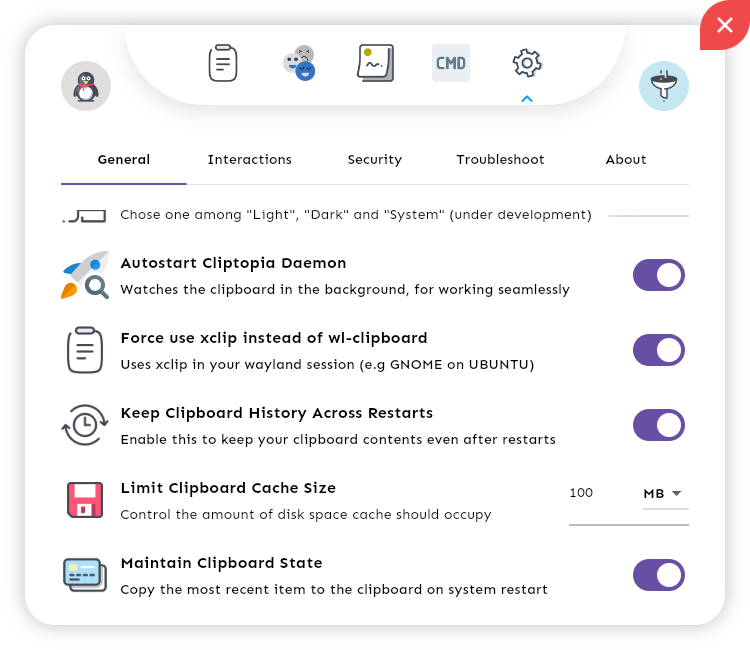
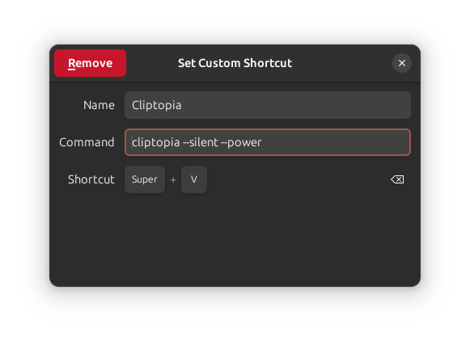
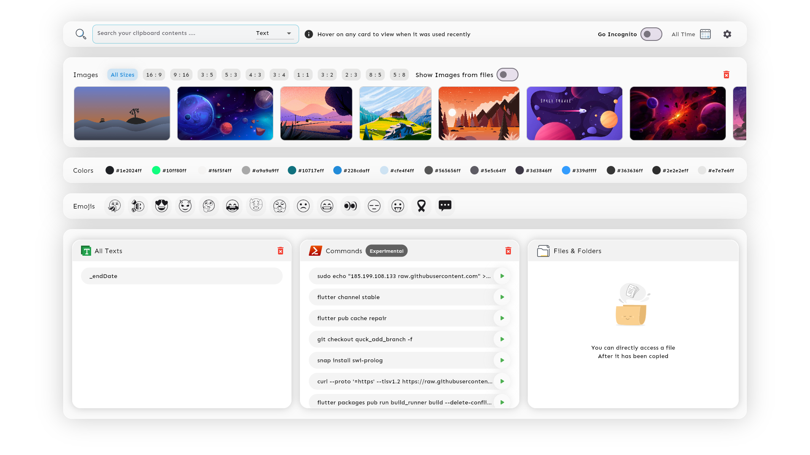
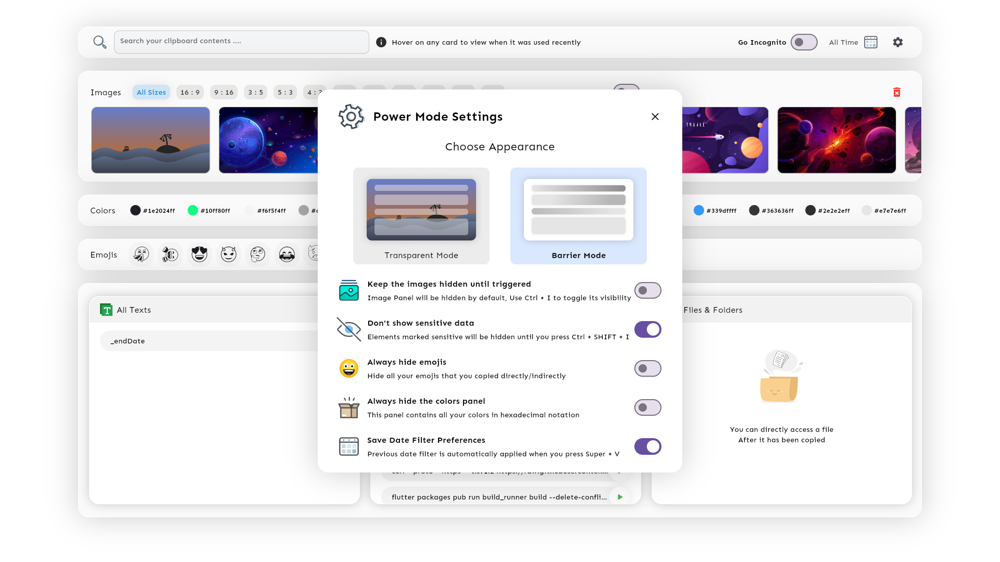
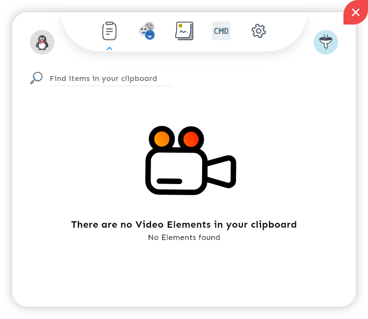

<div align="center" style="margin: 100px 0px 100px 0px">
    
    <br>
    <br>
    <a href="https://git.io/typing-svg"></a>
    <br>
    
    
    
    
    <br>
    <a href="https://www.buymeacoffee.com/imarham"></a>
    <br>
    <a href="https://github.com/omegaui/cliptopia_daemon"></a>
    <br>
    <a href="https://opensource.org/licenses/BSD-3-Clause"></a>
    <a href="https://omegaui.slite.page/p/SCCw4NaQYcBX1A/Cliptopia"></a>
</div>

# Cliptopia

Cliptopia is a state-of-the-art **clipboard management software** for the linux desktops that turns your simple clipboard into a full-fledged ⚡**power house**⚡

Cliptopia watches not only your texts but also any **emojis, colors, commands, web images, screenshots or any local file/directory** that you copy and then, it provides a full-fledged powerful interface supporting advanced searching and filtering which even allows you to search any image that you have copied. This is just the tip of the features Cliptopia provides out of the box.

As the names goes **Cliptopia**, it is all about your clipboard, but in the sense of vast land which is full of features that provides you a clipboard experience in the best ever form out there.

## Features

-   📝 Cliptopia supports commenting on clipboard items
-   ⛑️ Clipboard Content Protection Mechanism
-   🤞 Handy set of shortcuts to toggle sensitive data
-   🔍 Regex mode content filtering
-   🥽 Go Incognito with just a click of a toggle
-   📀 An intelligent cache management system
-   📂 File extension mode searching
-   🏜️ Protecting your clipboard contents from being accidentally displayed during screen sharing
-   📅 Filtering Items by Date
-   ❣️ Finding Items by comments
-   🌈 Filtering Images on the basis of aspect ratios
-   ☢️ Displaying images from copied files
-   🧭 Compositor independent content injection  
    (even if your desktop environment doesn't supports **virtual-keyboard-protocol **cliptopia never fails to work 🚀)
-   🐞 Built-in App Bug Report Generation
-   ⚠️ Built-in issues identification panel
-   ⛱️ Command execution right from the User Interface
-   😎 Fully Compositor Independent (No matter if it is **X11** or **Wayland**, Cliptopia rocks)
-   And a very attractive custom User Interface ❣️

See [The Daemon](https://slite.com/api/public/notes/l9bdqAzEIRZ7dG/redirect) , to explore more features.

##  The Daemon
At the heart of Cliptopia lies the [`cliptopia-daemon`](https://github.com/omegaui/cliptopia_daemon) which is responsible for watching your clipboard.

When you install Cliptopia,
you can run it directly from the app launcher or by just executing `cliptopia` in your terminal or by pressing Super + V after you have created the clipboard shortcut.
In any case, cliptopia will ask you to install the daemon ...

Either you can download/build it from source by yourself from its [repo](github.com/omegaui/cliptopia_daemon) or you let cliptopia handle this for you. 
Yes, Cliptopia can itself download the daemon for you if you desire so.

Moving further, in any case, the daemon should be placed at `/usr/bin` so that cliptopia can manage it.

**Cliptopia is compositor independent** which means it works the same no matter you are on X11 or Wayland.
On X11, `xclip` is used to watch the clipboard and on Wayland `wl-clipboard` is used.

On some distros, like **Ubuntu with GNOME on Wayland**, xclip still works because of an XWayland session, so, if you want you can force cliptopia to use `xclip` even on wayland also from its settings panel.



#### Please note that Cliptopia is in beta until a stable version releases, which is expected to be released by the end of this month.

## Installation

Right now, you can only install cliptopia from source.

Before that you need the following commands available in your linux distribution ...

- grep
- java 17 or above
- xclip
- pgrep
- pkexec
- whereis
- wl-clipboard (for wayland only)
- and optionally **flutter** 3.16 or above if you are installing from source.

Yes, Cliptopia is written entirely using Flutter, thus, it compiles to native and delivers lightening fast performance as your other apps.

Installing Cliptopia is a very easy and fast process ...

-   Just Clone the official repo 

```bash
git clone https://github.com/omegaui/cliptopia
```

-   move into the cloned repo

```bash
cd cliptopia
```

- and run the install-from-source.sh script to install from source

```bash
./install-from-source.sh
```

Running the above commands in sequence will install cliptopia on your machine.

If you have already installed cliptopia, running the above commands will result in manually updating your installation.

## Keyboard Shortcut
Then, you need to add a custom keyboard shortcut to invoke Cliptopia in Power Mode ...


## Modes
Cliptopia can be made to launch in three mode:
- Normal Mode (`cliptopia`)
- Silent Mode (`cliptopia --silent`)
- Power Mode (`cliptopia --silent --power`)

Injection: it refers to clicking on an clipboard element in the UI of Cliptopia to insert it in the last focussed field.

### Normal Mode
- Updates in real time as you use your clipboard
- Supports content injection
- Does not quits after injection is performed

### Silent Mode
- Updates in real time as you use your clipboard
- Supports content injection
- Quits after injection is performed

### Power Mode
- Does **NOT** updates in real time as you use your clipboard
- Supports content injection
- Quits after injection is performed

There is a very valid reason Power Mode is designed to not update in real time,
as we know, Super + V combination can be used to bring the Power Mode into effect,
it is designed to be used occasionally when you require to find an item that you copied earlier and in cases, 
where you need to do this quickly. 

So, for the Power Mode to get ready in an instant, a single read of the cache is performed to deliver the fastest possible 
performance on your system, thus, preventing the real time updates as there is no watching of the cache being maintained by the daemon.

That's why power mode does not update in realtime.

But, We do not stop here, actually the Power Mode can be made to update in real time, by using the `--update` flag.
Work on this is currently under development. 

## Updates

Cliptopia will have a built-in update system, so, when a new release arrives, your installation will automatically notify you about it.

## Uninstallation

Cliptopia will even offer an in-app uninstall feature to uninstall cliptopia from your system in case you want a fresh install.

## Screenshot Gallery








          